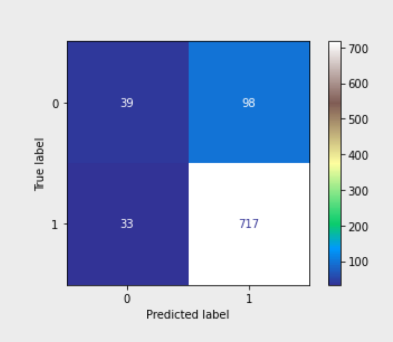
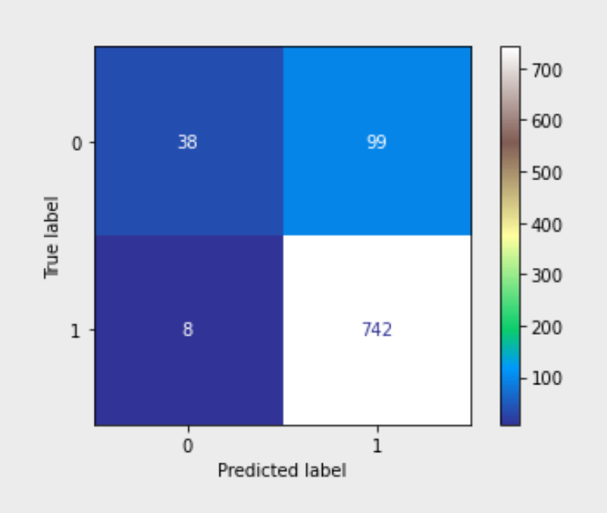
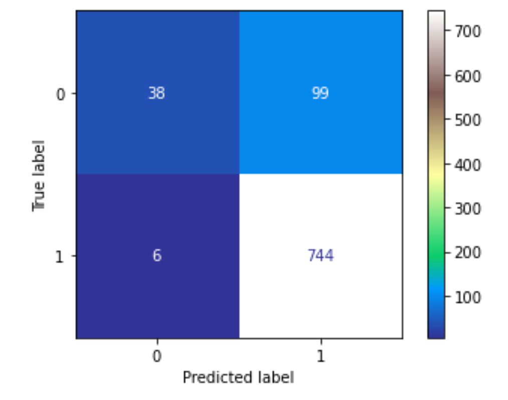

 <h1> Tweet Sentiment Analysis </h1> 

 <h2> Natural Language Processing Modeling</h2> 

  

 Photo by Solen Feyissa - Courtesy of <a href="https://www.pexels.com/photo/internet-connection-technology-travel-5744251/"> Pexels </a> 

 <h4> Phase 4 Project by Ashley Eakland and Jose Harper </h4> 

## Main Files:
* NLP.ipynb - main notebook with code, eda, models, and findings
* Presentation.pdf
* tweets.xlsx

## Introduction

Stakeholder: Research firm wanting to gain insight into consumer feelings on tech companies and products based on Tweet content that convey positive or negative emotions.

## Business Problem

* To ensure the best possible experience for consumers, we aim to accurately predict whether a given Tweet is of positive or negative sentiment based on the content of the Tweet. 

**Subproblem:**
* In terms of the business problem at hand, priority will be on minimizing False Positives (i.e. model identifies as a positive sentiment, when really the tweet was of negative connotation). Targeted metrics will be Accuracy and Precision.

**Data assumptions:**
Data was given on the tweets of over 9000 SXSW festival goers that gave emotion of positive, negative or neutral sentiment. We aim to be able to correctly identify tweet sentiment based solely on tweet content using NLP predictive modeling. While there is nothing that explicitly states these tweets are from festival goers, we are listing this under data assumptions as the top most frequent word was "sxsw" and it also was a top ranking feature of importance in the top performing model at initial analysis. This lends itself to our belief that these tweets were collected from a subset of tweets from/pertaining to the festival, as these tweets contained "sxsw" as a hashtag.

## Data Understanding

* 9093 rows consisting of 3 columns. Data comes from CrowdFlower via data.world.
* Human raters rated the sentiment in over 9,000 Tweets as positive, negative, neither or "can't tell". "Can't tell" really is not of much use to us for this analysis and will be dropped.
* Neutral reviews far outweigh the other sentiments, with positive being the next majority and negative being the lowest in terms of volume.
* Target column is going to be our "is_there_emotion..." column, which was renamed (described in Data Prep). Corpus is held in the "tweet_text" column.
* "Emotion in Tweet Directed At" has many null values - but at this current point in time, it is undetermined if this column is going to be of value. For now, will replace the nulls with "Unknown".
* Beginning with a binary classification problem and working with Positive/Negative only, but will keep Neutral reviews on standby for addition if time allows.

 ## EDA-Data Preperation
 
* For readability, renaming some wordy columns from "emotion in tweet is directed at" to "Directed At" (just in case we need this column later) and "is there and emotion directed at brand or product" to "Emotion" - this is our Target.
* "I Can't Tell" as an emotion value is not going to be helpful to us for this analysis, and therefore will be dropped. We've made a copy of the data frame that keeps the "neutral" reviews should we have time to revisit and work as a tertiary classification problem.
* Using the LabelEncoder, transformed Positive and Negative to 1/0's with 1 representing Positive sentiment and 0 representing negative. For this binary classification modeling, positives outweigh negatives 84% to 16%. Will experiment with class weight during modeling to see if this imbalance presents a problem.
* Train-Test split is performed with 75/25 split and a random state set for reproducability.
Utlizing code from previous labs and workbooks, analyzing the top 15 words (after removal of stopwords, punctuation and applying lowercase).
* Secondary train-test split is applied as a precaution and in preparation of final model evaluation. Model iteration will be performaed utilizing training and validation data, with the secondary split acting as the validation data and the initial split test data as a final hold out to be used on the final model selected.
* CountVectorizer
    * Running two separate Vectorizers, one restricted to 100 words and a second restricted to 2500. After modeling, it is clear that more words is equivalent to better performance. TF-IDF does seem to perform better than the CV method.
* TF-IDF Vectorizer
    * Unrestricted vocabulary tokenization of training and testing tweets for modeling, as well as a restricted set to 835 words. Optimal models with initial analysis ended up performing better with the restricted TF-IDF vectorized data.

## Modeling- Binary Classification 

We modeled utilizing models that can handle a class imbalance without severe consequence in performance, though we did test run with class weight set to "balanced" to check performance. This parameter did not seem to affect the final results of the model performance much. Models consistently performed between the upper 70's to upper 80's across the board, with KNN and Decision Trees being the lower or less consistent performers and Bayes and RandomForest being the more solid of the models. 

After initial modeling, we ran a second iteration of models with a second set of vectorized vocabulary with the "Twitter Specific" words such as "mention", "link" and "quote" removed from the vocabulary to assess performance. We saw consistent performance, with metrics still in the upper 80's on the unseen data. The key features changed considerably (which is to be expected when the initial key features contained some of these "stopwords"), but the performance was inline with previous results. The results of each final evaluation can be seen broken into sections below with appropriate headers.

### Validation Model Results - Initial Modeling with Twitter Specific 'stopwords' included

#### Multinomial Bayes Models
##### Top Performing Naive Bayes Model - 'mnb3'
* Model was evaluated on CountVectorized Data restricted to a 2500 word vocabulary.
* Precision Score: 86%
* Accuracy Score: 85%

#### Decision Trees Models
##### Top Performing Decision Tree Model - 'dt2'
* Model was evaluated on TF-IDF Vectorized Data restricted to an 835 word vocabulary.
* Precision Score: 87%
* Accuracy Score: 82%

#### Random Forest Models
##### Top Performing Random Forest Model - 'rf_tfidf'
* Final Assessed Random Forest has best Precision Score. Model was evaluated on TF-IDF Vectorized Data restricted to an 835 word vocabulary. Unrestricted TF-IDF vocabulary yielded VERY similar results, sacrificing less than a percent in Precision for less than a half a percent gain in Accuracy.
* Precision Score: 86%
* Accuracy Score: 85%

#### KNN Models
##### Top Performing KNN Model
* Initial KNN Model had best metrics. Performed on CountVectorized Data with 2500 word vocabulary.
* Accuracy 83%
* Precision 87%

### Unseen Data Test Results - Initial Modeling with Twitter Specific 'stopwords' included
##### Final Results

Given the above best performing models and metrics seen on the validation data above, the hold out dataset was fed into the Naive Bayes and the RandomForest models for final scores and evaluation on the initial run.

##### Multinomial Naive Bayes Final Performance - 'mnb3' - Optimal Performance above on CV with 2500 word vocabulary
* Final Accuracy - 85.23 %
* Final Precision - 87.98 %

  

##### RandomForest Final Performance - 'rf_tfidf' - Optimal Performance above on TF-IDF with 835 word vocabulary
* Final Accuracy - 87.94 %
* Final Precision - 88.23 %

  

### Twitter Specific Language Iteration Revisions - additional Models with removal of Twitter Specific Stopwords

#### Top Performer - RandomForest with 4150 word vocabulary - utilizing TF-IDF Vectorizer
* Final Precision: 88.26%
* Final Accuracy: 88.16%

  

##### Multinomial Bayes performs similarly here without the Twitter Stopwords using CountVect with 2500 word Vocab.
* Final Precision: 88.45%
* Final Accuracy: 86%

##### RandomForest with unrestricted performs almost identically as the previous models without the Twitter Stopwords.
* Final Precision: 88.26%
* Final Accuracy: 88.16%

##### RandomForest with restricted vocab performs slightly worse in terms of accuracy without the Twitter Stopwords compared to it's unrestricted counterpart.
* Final Precision: 88.26%
* Final Accuracy: 87.49%

##### KNN Evaluated again as sanity check. Performs about the same comparatively to the previous KNN model, a bit better in terms of accuracy.
* Final Precision: ~ 87%
* Final Accuracy: 84%

## Further Analysis

At a later date, we feel it would be worth exploring adding the 'neutral sentiment' tweets back into the data for modeling and analysis with a multiclass classification model. Additionally, worth consideration  is a deeper dive into the tweet specific words (hashtags, acronyms), if any additional exist in the vocabulary for removal or addition back in, as well as bigrams and how the consideration of word combinations would affect the model performance. Lastly, identifying which products and brands are identified with which sentiments (positive/negative/neutral) is definitely something that would be worth dialing in during the future improvements stage. 

### For more information or questions, please reach out to Jose Harper at <harper.jose@gmail.com> or Ashley Eakland at <ashley@eakland.net>.

## Repository Structure (subject to change)
* Images
* Docs
* NLP.pptx
* NLP.ipynb

